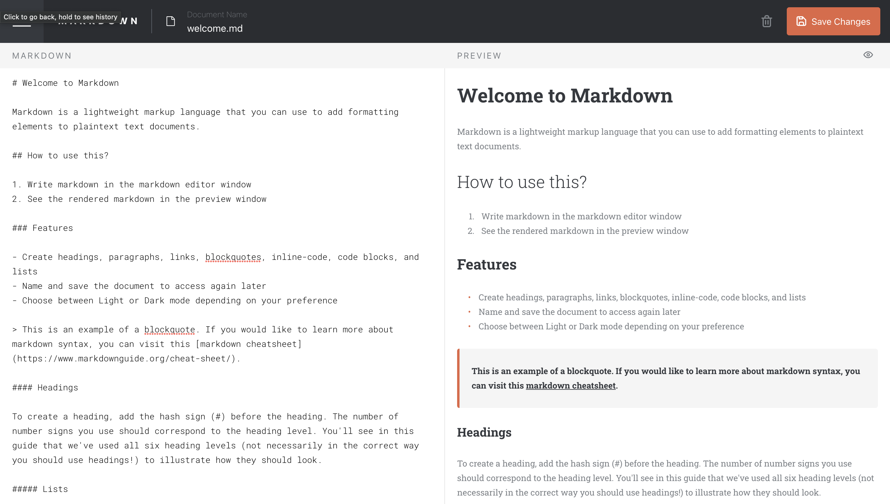
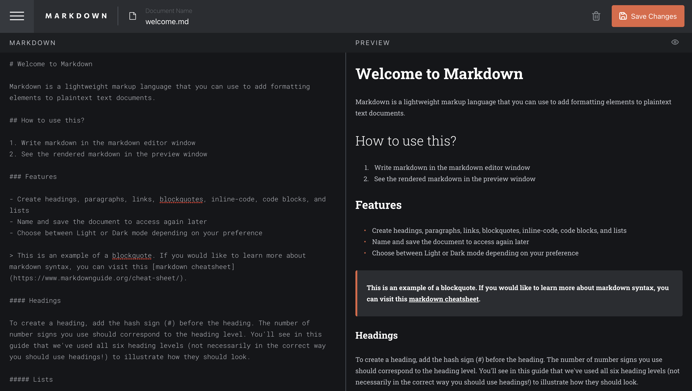

# Frontend Mentor - In-browser markdown editor solution

This is a solution to the [In-browser markdown editor challenge on Frontend Mentor](https://www.frontendmentor.io/challenges/inbrowser-markdown-editor-r16TrrQX9). Frontend Mentor challenges help you improve your coding skills by building realistic projects. 

## Table of contents

- [Overview](#overview)
  - [The challenge](#the-challenge)
  - [Screenshot](#screenshot)
  - [Links](#links)
- [My process](#my-process)
  - [Built with](#built-with)
  - [What I learned](#what-i-learned)
  - [Continued development](#continued-development)
- [Author](#author)

## Overview

### The challenge

Users should be able to:

- Create, Read, Update, and Delete markdown documents
- Name and save documents to be accessed as needed
- Edit the markdown of a document and see the formatted preview of the content
- View a full-page preview of the formatted content
- View the optimal layout for the app depending on their device's screen size
- See hover states for all interactive elements on the page
- **Bonus**: If you're building a purely front-end project, use localStorage to save the current state in the browser that persists when the browser is refreshed
- **Bonus**: Build this project as a full-stack application

### Screenshot

### Links

- Solution URL: [GitHub](https://github.com/arjunkdot/in-browser-markdown-editor)
- Live Site URL: [Live Demo](https://markdown-arjunkdot.netlify.app/)

## My process

### Built with

- [React](https://reactjs.org/)
- [TypeScript](typescriptlang.org)
- [Redux](https://redux.js.org/)
- [Redux Toolkit](https://redux-toolkit.js.org/)
- [Tailwind CSS](https://tailwindcss.com/) - For styles

### What I learned

This was my first-ever introduction to TypeScript. Even though I struggled sometimes to figure out which type to use, generally I had a pleasant developing experience. I can definitely see myself using TypeScript for my future projects.

### Continued development

I started this out in hopes of building a full-stack application, but since I was building this between the free hours and on weekends while working full-time it took me more time than I thought it'd take initially. I'm also kinda bored working on this project for a while now and have been trying to move on to something else. I hope I'll get back to this someday. I also have plans to write some tests (probably using Vitest & RTL) to see how it holds out. 

## Author

- Frontend Mentor - [arjunkdot](https://www.frontendmentor.io/profile/arjunkdot)
- Twitter - [@arjunkdot](https://www.twitter.com/arjunkdot)
# MarkDown-Editor
